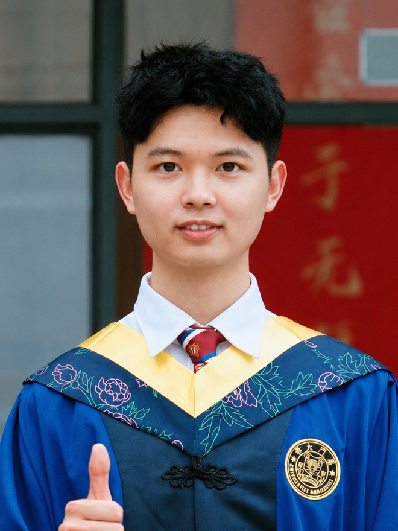

# 🌟 Jian Zhang | 张舰

---

<table>
<tr>
<td width="30%" align="center">

 

**🎓 Graduate Student**  
_Xiamen University_

</td>
<td width="70%">

## 🚀 Research Vision

> _My long-term vision centers on comprehensive **3D spatial understanding**: building 3D vision-language models, semantic reconstruction systems, and embodied agents that can reason about and interact with the physical world._

### 🎯 Current Focus Areas

- **🔬 3D Spatial Understanding**
- **🧭 3D Vision-Language Models**
- **🤖 Embodied Intelligence Agents**

</td>
</tr>
</table>

---

## 🎓 Education

- **M.S. Information & Communication Engineering** | _Xiamen University_ (Sept 2023 - Present) 
  Advisors: [Yue Huang](https://huangyue05.github.io/) and [Xinghao Ding](https://informatics.xmu.edu.cn/en/info/1069/1076.htm)
- **B.S. Data Science and Big Data Technology** | _Nanchang University_ (Sept 2019 - June 2023)

## 💼 Experience

- **Remote Research Assistant** | _[PHAI Lab](https://phai-lab.github.io/), Texas A&M University_ (May 2025 - Aug 2025) 
  3D Vision & Embodied Intelligence
- **Remote Research Assistant** | _[VITA Group](https://vita-group.github.io/group.html), University of Texas at Austin_ (Jan 2024 - May 2025) 
  3D Semantic Reconstruction

---

## 📚 Featured Publications

### 🔥 **Recent Highlights**

### 🧭 SpatialStack: Layered Geometry-Language Fusion for 3D VLM Spatial Reasoning

**CVPR 2026** | **Jian Zhang\***, Shijie Zhou*, Bangya Liu*, Achuta Kadambi, Zhiwen Fan

Fuses layered geometry-language features for 3D spatial reasoning.

---

### 🌟 VLM-3R: Vision-Language Models Augmented with 3D Reconstruction

**CVPR 2026** | Zhiwen Fan\*, **Jian Zhang\***, Renjie Li, Junge Zhang, Runjin Chen, Hezhen Hu, Kevin Wang, Huaizhi Qu, Shijie Zhou, Dilin Wang, Zhicheng Yan, Haozhe Xu, Jan Theiss, Tianlong Chen, Junyi Li, Zuxuan Tu, Zhangyang Wang, Rakesh Ranjan

Aligns VLMs with 3D reconstruction for spatial-temporal reasoning.

---

### 🧠 Thinking in Dynamics: Multimodal Reasoning in Physical 4D Worlds

**CVPR 2026** | Yuzhi Huang*, Kairun Wen*, Rongxin Gao\*, Dongxuan Liu, Yibin Lou, Jie Wu, Jing Xu, **Jian Zhang**, Zheng Yang, Yunlong Lin, Chenxin Li, Panwang Pan, Junbin Lu, Jingyan Jiang, Xinghao Ding, Yue Huang, Zhi Wang

Benchmarks MLLMs on dynamic 4D physical reasoning.

---

### 🌍 DynamicVerse: Physically-Aware Multimodal Modeling for Dynamic 4D Worlds

**NeurIPS 2025** | Kairun Wen*, Yuzhi Huang*, Runyu Chen, Hui Zheng, Yunlong Lin, Panwang Pan, Chenxin Li, Wenyan Cong, **Jian Zhang**, Junbin Lu, Chenguo Lin, Dilin Wang, Zhicheng Yan, Haozhe Xu, Jan Theiss, Yue Huang, Xinghao Ding, Rakesh Ranjan, Zhiwen Fan

Builds physical-scale 4D world modeling data from real videos.

---

### 🏆 Large Spatial Model: End-to-end Unposed Images to Semantic 3D

**NeurIPS 2024** | Zhiwen Fan\*, **Jian Zhang\***, Wenyan Cong, Peihao Wang, Renjie Li, Kairun Wen, Shijie Zhou, Achuta Kadambi, Zhangyang Wang, Danfei Xu, Boris Ivanovic, Marco Pavone, Y. Wang

Maps unposed images directly to semantic 3D representations.

---

### ⚡ InstantSplat: Sparse-view Gaussian Splatting in Seconds

**ArXiv 2024** | Zhiwen Fan*, Wenyan Cong*, Kairun Wen\*, Kevin Wang, **Jian Zhang**, Xinghao Ding, Danfei Xu, Boris Ivanovic, Marco Pavone, Georgios Pavlakos, Zhangyang Wang, Y. Wang

Reconstructs sparse-view scenes with fast pose-free Gaussian splatting.

---

---

## 🌟 Open for Opportunities

<table>
<tr>
<td align="center" width="33%">
<h3>🧭</h3>
<b>3D Vision-Language Models</b>
 Reasoning over geometry and language
</td>
<td align="center" width="33%">
<h3>🔬</h3>
<b>3D Spatial Understanding</b>
 Developing comprehensive 3D perception
</td>
<td align="center" width="33%">
<h3>🤝</h3>
<b>Research Collaborations</b>
 Building the future of 3D AI together
</td>
</tr>
</table>

_Particularly interested in opportunities that bridge cutting-edge research with real-world applications._

---

## 📫 Contact

---

<picture>
  <source media="(prefers-color-scheme: dark)" srcset="https://capsule-render.vercel.app/api?type=waving&color=gradient&customColorList=12&height=100&section=footer&text=Thanks%20for%20visiting!&fontSize=16&fontColor=ffffff">
  <source media="(prefers-color-scheme: light)" srcset="https://capsule-render.vercel.app/api?type=waving&color=gradient&customColorList=12&height=100&section=footer&text=Thanks%20for%20visiting!&fontSize=16&fontColor=333333">
  
</picture>

_Building the future of 3D AI, one breakthrough at a time_ ✨

